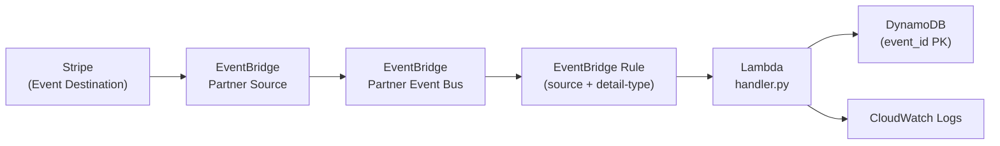
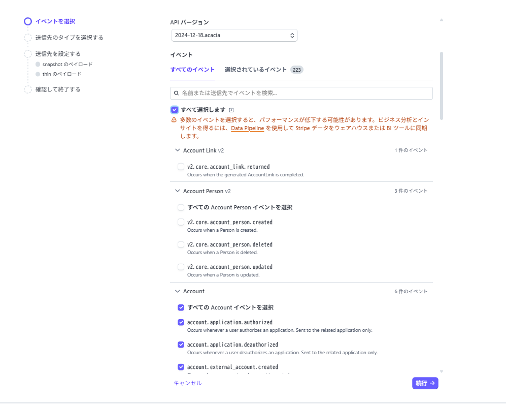

# Stripe と Amazon EventBridge の連携サンプル

## 概要
- Stripe の Event Destination（Amazon EventBridge 連携）で受け取ったパートナーイベントを Lambda で処理し、DynamoDB に保存するサンプルです。
- Terraform で EventBridge パートナーイベントバス、ルール、Lambda、IAM ロール/ポリシー、DynamoDB テーブルを構築します。

## 監視しているイベント

| 状態の変化              | 発火イベント                          |
| -------------- | ------------------------------- |
| サブスク作成           | `customer.subscription.created` |
| サブスクの内容が変更された    | `customer.subscription.updated` |
| トライアル終了後、請求書作成   | `invoice.created`               |
| 支払い成功            | `invoice.payment_succeeded`     |
| 支払い失敗            | `invoice.payment_failed`        |
| サブスクが削除/キャンセル    | `customer.subscription.deleted` |

EventBridge ルールでは上記 6 種類の `detail-type` のみを許可し、それ以外の Stripe イベントは Lambda に渡さないようフィルタしています。

## アーキテクチャ



## 必要なもの
- Terraform v1.6 以上
- AWS アカウントと認証情報（デフォルト地域は `ap-northeast-1`。必要なら `aws_region` を変更）
- Stripe アカウント（Event Destination で Amazon EventBridge を有効化できる権限）

## セットアップ手順
1. **Stripe 側で EventBridge を有効化**  
   Stripe Dashboard → Developers → Event destinations → Amazon EventBridge を追加し、イベントは「すべて」を選択してください（フィルタは EventBridge 側で実施）。表示されるパートナーイベントソース名を控えます（例: `aws.partner/stripe.com/12345/prod`）。
   
   

2. **変数を設定**  
   `terraform.tfvars` を作成し、少なくともパートナーソースのプレフィックスを指定します。
   ```hcl
   aws_region                      = "ap-northeast-1"
   stripe_event_source_name_prefix = "aws.partner/stripe.com/12345/prod"
   table_name                      = "stripe_webhooks"
   project_name                    = "stripe-eventbridge-demo"
   ```

3. **デプロイ**  
   ```bash
   terraform init
   terraform apply
   ```
   完了後に表示される出力で、作成された Lambda 名や DynamoDB テーブル名を確認できます。

4. **動作確認**  
   - Stripe の「Send test event」から任意のイベントを送信。
   - DynamoDB テーブル（デフォルト `stripe_webhooks`）に `event_id` をキーとしたレコードが作成されることを確認。

5. **後片付け**  
   ```bash
   terraform destroy
   ```
   データ保持が不要なら DynamoDB テーブルも合わせて削除されます。

## 仕組み
- Stripe で有効化されたパートナーイベントソース名と同名の EventBridge パートナーイベントバスを作成します。
- ルールは `source` をパートナーソースで、`detail-type` を上記 6 イベントに絞り、該当するものだけを Lambda へ転送します。
- Lambda は受信イベントの `detail` から Stripe イベント ID を抽出し、DynamoDB に idempotent に保存します（同じ `event_id` が存在する場合はスキップ）。

## カスタマイズ例
- 監視するイベントタイプを増減したい場合: `main.tf` の `aws_cloudwatch_event_rule` にある `detail-type` 配列を編集します。
- 保存するフィールドを増やしたい場合: `lambda/handler.py` の `item` にフィールドを追加します。

## 注意点
- パートナーイベントソースは Stripe 側で有効化しないと `data.aws_cloudwatch_event_source` が見つからず、Terraform が失敗します。必ず先に Stripe 設定を完了してください。
- `terraform.tfstate` などの状態ファイルは機密情報を含むためバージョン管理に含めないでください。
